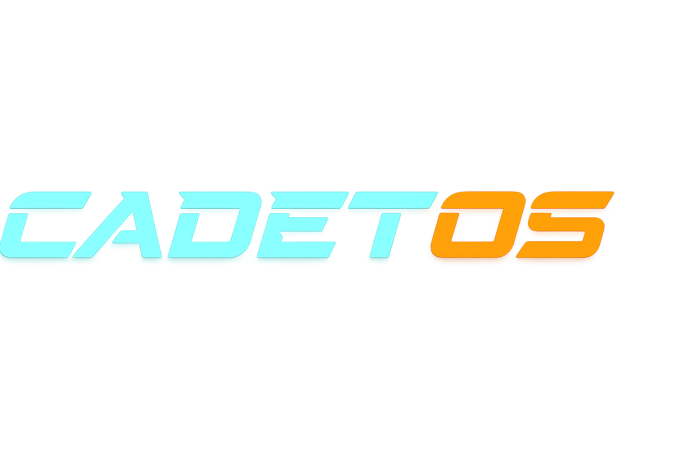
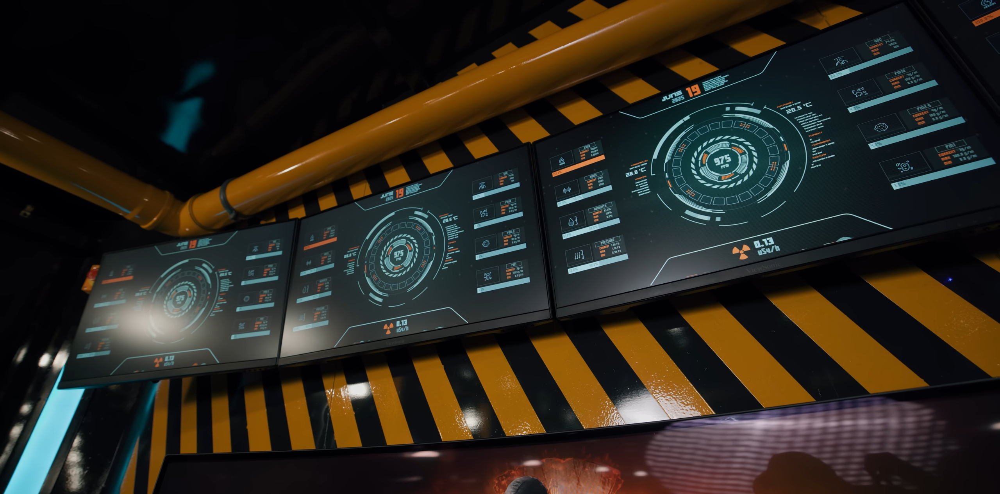

<p align="center">
	
</p>


# cadet.os

<p align="center">
	<a href="https://github.com/mausicadev/cadet.os"></a>
	
	<a href="https://github.com/mausicadev/cadet.os/stargazers"></a>
</p>

<p align="center">
  <a href="https://cadetos.vercel.app" target="_blank" rel="noopener">
    
  </a>
</p>

_Handmade bunker UI → web OS — rugged, simple, and expanding into hardware._

I'm a 12th-grade student at a military school in Romania. I started this project because a friend runs a bunker and needed an interface — the first version (screenshot below) ran there. Now I'm expanding it into a web OS that will be part of my hardware project, Sweet Blast.

<p align="center">
	
</p>

---

**Quick features**

- 🪟 Desktop-like windows and a dock
- 🖥️ Terminal with custom commands
- 📁 File manager, notes, task list, and telemetry dashboard

**Try it**

```bash
git clone https://github.com/mausicadev/cadet.os.git
cd cadet.os
npm install
npm run dev
```

Open the local Vite URL in your browser to try it.

Short, simple, and built with stubbornness.

---

Made by a 12th-grade student in Romania — part of the Sweet Blast hardware project.
