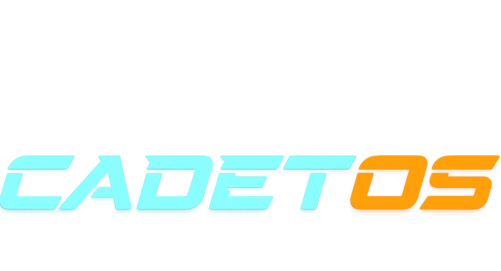
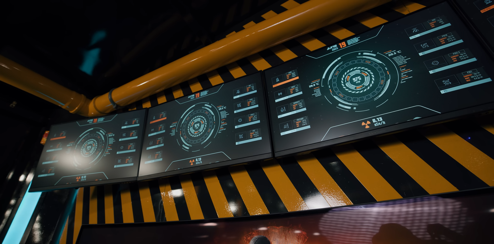

	

	
	
	

  

_A smart initiative that might revolutionize how you look at smart devices :)_

I'm a 12th-grade student at a military school in Romania. I started this project because a friend runs a bunker and needed an interface, the first version (screenshot below) ran there. Now I'm expanding it into a much bigger project that I want to control al the smart devices in the house from a TV to a lamp or a smart desk while also trying to keep everything local.

	

---

P.S.
user: admin
password: admin ( I work now on autologin for demo purposes )

## A short story

The project started with just HTML and CSS. I later discovered D3 (and similar libraries) and got inspired by a Jarvis-style Windows theme and a YouTube video showing a futuristic HUD. As a funny note, I wasn't great at the math for centering circles, so I aligned a lot of things by eye and guesswork (that's why there are 20 circles). For one circle I used the value 1.57 and only later realized it was $\frac{\pi}{2}$ :)))

Now I'm updating the project to try to keep everything local and private (even though it is hosted for now) I want to implement a small assistant similar with Alexa, but local, meaning I want it to process everything locally on the host computer. Regarding what I did till' now I started working on the interface, basically the front-end, I connected the first part with a uradmonitor sensor installed near the bunker and show the data taken from it, and now I am trying to add some helpfull things to have basically some basic tools that I can use locally (notes, tasks etc...) between al computers connected in the local network, on the AI side...I used AI to help transform the prototype from vanilla HTML/CSS/JS (It was the first programming language that I learnt alongside Python) into React and that's why it feels a bit AI-ish and now I try to figure out a way to connect the deivces in the home page.

---
And my favourite invented by me quote :) .....

> „Omul să fie fericit cu proiectul lui, căci, dacă e vorba, nu complexitatea, ci drumul parcurs îl face fericit.”

_— Marius Gabriel, 2026_

